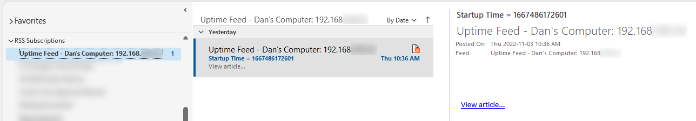
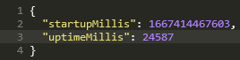

# Uptime Feed
## _Did the server restart?_

RSS and JSON application startup notifications, useful for informally notifying affected users of unexpected server restarts.

## Why?

Sometimes the application support team are the last ones to hear about unexpected server restarts.
It's not the fault of the busy systems administrators responding to the problem,
but finding out about server problems sooner helps everyone.

## What Does it Do?

This simple application runs on a server, preferably as a service that starts with the server.
It hosts an RSS Feed (and a JSON response, if that's your preference)
with the last time the application was started.

If the server restarts, the timestamp will change, resulting in a new notification.

If the feed is unavailable, either the application is down or the server is.

## Getting Started

**Download** a release or clone the repository.

**Install** the dependencies.

    npm install

Create a `data/config.js` file.

    cp data/configSample.js data/config.js

**Run** the application.

    npm start

Alternatively, the application can be set up as a Windows service.

    npm link node-windows
    windowsService-install.bat

**Subscribe** to the RSS feed or read the JSON file.
_Note that the server port is configurable,_
and there is an option to customize the URLs (helpful when proxying).

    http://serverName:9111/rss
    http://serverName:9111/json
